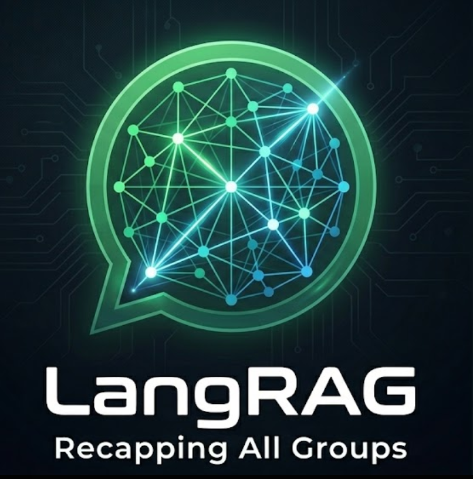
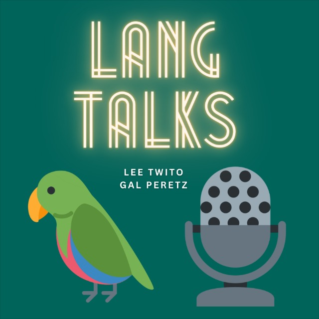
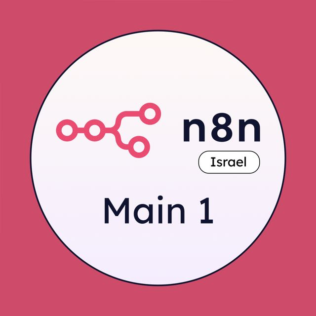
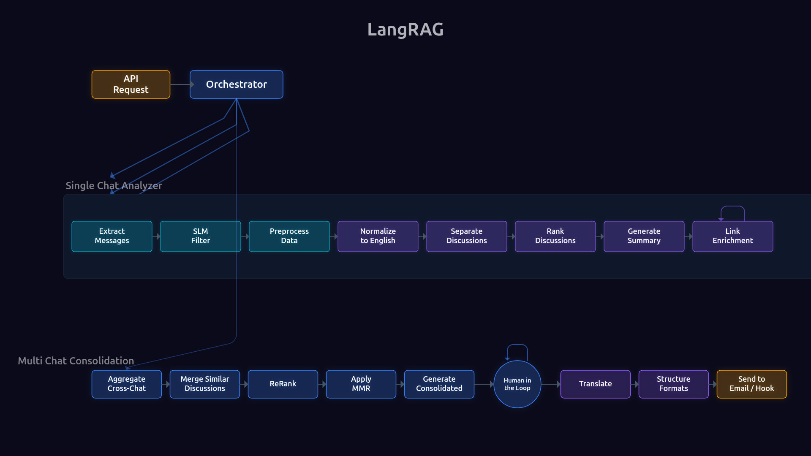

<div align="center">

  

  <h3>
    Everyone summarizes WhatsApp.<br>
    LangRAG goes deeper.<br>
    <sub>(With Beeper! )</sub>
  </h3>

  <h3>⭐ The newsletter solution chosen by AI community leaders since 2024 ⭐</h3>

  <a href="https://www.python.org/downloads/"></a>
  <a href="https://docs.docker.com/compose/"></a>
  <a href="https://fastapi.tiangolo.com/"></a>
  <a href="https://langchain-ai.github.io/langgraph/"></a>
  <a href="https://www.mongodb.com/"></a>
  <a href="https://langfuse.com/"></a>
  
  <a href="https://ollama.com/"></a>
  <a href="https://www.anthropic.com/"></a>
  <a href="https://creativecommons.org/licenses/by-nc/4.0/"></a>

</div>

<br>

## Table of Contents

- [Overview](#why)
  - [Why](#why)
  - [How](#how)
  - [What](#what)
- [Chosen By Leading AI-Engineering Communities](#chosen-by-leading-ai-engineering-communities)
  - [LangTalks](#langtalks)
  - [API: AI Protocols Israel](#api--ai-protocols-israel)
  - [n8n Israel](#n8n-israel)
- [How It Works](#how-it-works)
  - [Pipeline Overview](#pipeline-overview)
  - [Beeper: The Secret Sauce](#the-secret-sauce)
  - [Single Chat Analysis](#single-chat-analysis-an-8-stage-pipeline)
  - [Multi-Chat Consolidation](#multi-chat-consolidation-a-9-stage-pipeline)
  - [What Gives This Solution an Edge](#what-gives-this-solution-an-edge)
  - [Tech Stack](#tech-stack)
- [Setup](#setup)
  - [Getting Started](#getting-started)
  - [User Interfaces](#user-interfaces)
  - [API Examples](#api-usage)
  - [Configuration Reference](#configuration-reference)
  - [Adding Your Own WhatsApp Group](#adding-your-own-whatsapp-group)
- [Be a Friend](#be-a-friend)
  - [Improving LangRAG](#improving-langrag)
  - [Supporting LangRAG](#supporting-langrag)

---

### Why

If you're an AI engineer, you're dealing with FOMO.<br>
So community discussions are the best place for you to be up to speed, learn what's worth your attention, and sharpen your knowledge by discussing real-world challenges with peers.<br>
AI practitioners sharing nuanced, battle-tested insights and perspectives.<br>
**The problem:** the messages are too valuable to miss, but too many to keep up with.

### How

LangRAG uses **Beeper** for the crucial first phase: extracting WhatsApp messages along with rich metadata.<br> Then, LangRAG runs through async LangGraph pipelines that process group-chats in parallel, and generates structured newsletters. The analysis settings and output destinations are **deeply configurable**.<br> Currently works with OpenAI or Anthropic as the LLM provider.<br> **Cost-optimized** with Batch API (50% savings) and local SLM pre-filtering (15-30% additional savings).<br> Full observability via Langfuse, Prometheus, and Grafana.

### What

Generating newsletters since November 2024 across lively communities containing 12+ active WhatsApp groups with more than 8,000 distinct members.

---

## Chosen By Leading AI-Engineering Communities

<!-- TODO: Replace placeholder logos, LinkedIn URLs, and join links with real ones -->

### LangTalks




Israel's largest AI-engineering community.

Founded by [Lee Twito](https://www.linkedin.com/in/lee-twito/) & [Gal Peretz](https://www.linkedin.com/in/gal-peretz/)

[Join the community 🍕🍻](https://langtalks.ai/)

<br clear="left">

<hr width="50%" align="center">

### API: AI Protocols Israel


The go-to community for MCP, A2A, MCP-UI, and emerging AI protocol standards.

Founded by [Gilad Shoham](https://www.linkedin.com/in/shohamgilad/), [Leon Melamud](https://www.linkedin.com/in/leon-melamud/) & [Adir Duchan](https://www.linkedin.com/in/adir-duchan/)

[Join the community 🍕🍻](https://www.linkedin.com/company/106916433/)

<br clear="left">

<hr width="50%" align="center">

### n8n Israel




Israel's workflow automation community.

Founded by [Elay Guez](https://www.linkedin.com/in/elay-g/), [Gilad Shoham](https://www.linkedin.com/in/shohamgilad/) & [Leon Melamud](https://www.linkedin.com/in/leon-melamud/)

[Join the community 🍕🍻](https://www.linkedin.com/company/israel-n8n/)

<br clear="left">

---

## How It Works

### Pipeline Overview

<div align="center">
  
</div>

<details>
<summary><strong>View static diagram</strong></summary>

<div align="center">
  
</div>

</details>

---

### The Secret Sauce


Most WhatsApp export tools lose reply metadata - the link between a reply and the specific message it responds to. Without it, discussion-separation algorithms must fall back on timestamp proximity and content similarity, which is inherently error-prone. A group member might continue a discussion hours or even a full day later, replying to a message from yesterday - but with dozens of unrelated messages in between, there's no reliable way to reconstruct that thread from timestamps alone.

**[Beeper](https://github.com/beeper)** solves this by bridging WhatsApp to the Matrix protocol. Matrix exposes the `m.in_reply_to` field on every reply event, giving LangRAG explicit reply chains rather than guesses. The `separate_discussions` node uses these chains as its primary signal for grouping messages into topical discussions, with LLM-based content analysis as a secondary signal for standalone messages.

Better data, better results.

### Single Chat Analysis: An 8-Stage Pipeline

Each chat runs through the **SingleChatAnalyzer** - a LangGraph pipeline which would be used as a subgraph in multi-chat. These are its stages:

#### 1. Extract Messages
Pulls messages from the selected groups, using a Beeper/Matrix bridge. Preserves metadata for reply threading. Includes automatic decryption using a hybrid decryption manager with three configurable strategies: persistent session store, server-side key backup, and manual key export.

#### 2. SLM Filter *(optional)*

A local Phi3 model (via Ollama) classifies each message as **KEEP**, **FILTER**, or **UNCERTAIN**. Reduces downstream LLM API calls by 15-30%. Fail-soft: if the SLM is unavailable, the pipeline continues without filtering. UNCERTAIN messages always pass through to the LLM pipeline.

#### 3. Preprocess Data

Parse timestamps, sender names, media attachments, and URLs. Pure transformation | no LLM calls. Structures raw Matrix events into a normalized message format.

#### 4. Normalize to English

Normalize all messages to English using gpt-4o-mini in batch mode. Messages already in English are skipped. This ensures consistent language for downstream analysis regardless of the source language.

#### 5. Separate Discussions

Group messages into topical discussions. Uses reply-to chains (from Beeper's `m.relates_to`) as the primary signal, with LLM-based content analysis as a secondary signal for standalone messages. Outputs a structured list of discussions, each with its constituent messages.

#### 6. Rank Discussions

Score discussions by importance and diversity. Uses a **discussion ranker subgraph** that combines multi-factor scoring with Maximal Marginal Relevance (MMR) re-ranking. Includes anti-repetition checks against previous newsletters (embedding cosine similarity + LLM validation) | reducing repeated content by up to 80%.

#### 7. Generate Summary

Create the newsletter content from the top-ranked discussions. Uses format plugins (`langtalks_format`, `mcp_israel_format`) to produce output as JSON, Markdown, and HTML. Each format defines its own structure, section ordering, and editorial style.

#### 8. Link Enrichment

Extract URLs from the original messages and optionally perform web searches to find additional relevant links. Inserts markdown hyperlinks into the newsletter content non-destructively | existing text is preserved, links are woven in contextually.

### Multi-Chat Consolidation: A 9-Stage Pipeline

When processing multiple WhatsApp groups, the **ParallelOrchestrator** coordinates the full pipeline. The orchestrator dispatches N chats concurrently using LangGraph's **Send API**, each running the full 8-stage SingleChatAnalyzer independently. After all chats complete, the consolidation stages begin:

#### 1. Aggregate Cross-Chat

Collect all discussions from all chats into a unified pool. Partial success is allowed | individual chat failures don't block others.

#### 2. Merge Similar Discussions

Identify and merge discussions about the same topic across different groups (embedding cosine similarity with configurable thresholds: `strict`, `moderate`, `aggressive`).

#### 3. ReRank

Score and rank the merged discussion pool using the same multi-factor scoring system, now operating cross-chat.

#### 4. Apply MMR

Apply Maximal Marginal Relevance re-ranking to balance quality with diversity across the consolidated discussion pool.

#### 5. Generate Consolidated

Create a single unified newsletter from the top-ranked discussions.

#### 6. Human in the Loop *(optional)*

For supported formats, the pipeline supports a **two-phase execution**. Phase 1 runs through consolidation and ranking, then **pauses** | presenting the ranked discussions to a human editor via the Web UI. The editor reviews, reorders, or deselects discussions. Phase 2 generates the newsletter using only the human-approved discussions.

#### 7. Translate

Final translation to the target language (if it's different than the normalized English which was used for analysis).

#### 8. Structure Formats

Format the newsletter output into multiple structures: JSON, Markdown, and HTML. Each format plugin defines its own structure, section ordering, and editorial style.

#### 9. Send to Email / Hook

The output handler dispatches to multiple destinations:

- **Local files** | JSON, Markdown, HTML saved to `output/` directory
- **Email** | Via SendGrid, Gmail, or SMTP2GO
- **LinkedIn** | Draft post via n8n webhook
- **Webhook** | Custom HTTP endpoint

---

### What Gives this Solution an Edge

| Feature | How | Impact |
|---------|-----|--------|
| Reply Threading via Beeper | Matrix `m.relates_to` metadata preserved through extraction | Precise discussion separation - no timestamp guessing |
| MMR Diversity Ranking | Multi-factor scoring + Maximal Marginal Relevance | Quality-diversity balance |
| Human-in-the-Loop | Two-phase pipeline with Web UI discussion selector | Editorial control over final newsletter content |
| Batch API | JSONL serialization, async polling, exponential backoff | 50% cost reduction |
| SLM Pre-filtering | Local Phi3 classifies KEEP/FILTER/UNCERTAIN before LLM | 15-30% additional savings |
| Hybrid Anti-Repetition | Embedding cosine similarity + LLM validation vs. last N editions | No repetition of content from previous N newsletters |
| Smart Discussion Merging | Configurable similarity thresholds + LLM validation | Better handling of cross-group similar discussions |
| Full Observability | Langfuse + Prometheus + Loki/Grafana, all fail-soft | Production monitoring |
| Link Enrichment | Auto-fetch URLs, non-destructive markdown insertion | References for further learning |
| LinkedIn Automation | n8n webhook integration | One-click LinkedIn draft publishing |

### Tech Stack

| Layer | Technology |
|-------|-----------|
| API | FastAPI (async) |
| Orchestration | LangGraph 1.0+ (native async graphs) |
| LLM | OpenAI or Anthropic (via LangChain) |
| Cost Optimization | Batch API (OpenAI / Anthropic) + Ollama SLM (Phi3) |
| Database | MongoDB 8 + Motor (async) + Atlas Vector Search |
| Message Source | Beeper / Matrix (matrix-nio, E2E encrypted) |
| Frontend | React 19 + TypeScript + SSE streaming |
| Observability | Langfuse, Prometheus, Loki, Grafana |
| Infrastructure | Docker Compose, nginx |

---

## Setup

### Getting Started

#### Prerequisites

- Docker and Docker Compose
- OpenAI/Anthropic API key
- Beeper account with WhatsApp bridge configured

#### 1. Beeper Setup

LangRAG reads WhatsApp messages through [Beeper](https://www.beeper.com/), which bridges WhatsApp to the Matrix protocol.

See the full setup guide: **[docs/setup/SETUP_BEEPER.md](docs/setup/SETUP_BEEPER.md)**

Quick version:
1. Create a Beeper account and link your WhatsApp
2. Export your E2E encryption keys from the Beeper Web UI
3. Place the exported keys file at `./secrets/exported_keys/element-keys.txt`
4. Set `BEEPER_EMAIL`, `BEEPER_PASSWORD`, and `BEEPER_EXPORT_PASSWORD` in `.env`

#### 2. Clone and Configure

```bash
git clone https://github.com/eladlaor/langrag.git
cd langrag

cp .env.example .env
# Edit .env | at minimum set: OPENAI_API_KEY or ANTHROPIC_API_KEY, BEEPER_USERNAME, BEEPER_PASSWORD

# Generate required secrets
echo "LANGFUSE_AUTH_SECRET=$(openssl rand -base64 32)" >> .env
echo "LANGFUSE_SALT=$(openssl rand -base64 32)" >> .env
echo "LANGFUSE_DB_PASSWORD=$(openssl rand -base64 32)" >> .env
```

See [Configuration Reference](#configuration-reference) for the full list of parameters and environment variables.

#### 3. Start Services

```bash
docker compose up -d
```

That's it.

### User Interfaces

| Service | URL | Purpose |
|---------|-----|---------|
| Web UI | http://localhost | Newsletter generation, scheduling, run browser |
| CLI | `curl` / any HTTP client | Direct API access for scripting and automation |
| API docs | http://localhost/docs | Interactive FastAPI Swagger docs |
| LangGraph Studio | printed by `langgraph dev` | Visual graph inspector for nodes, edges, and subgraphs |
| Langfuse | http://localhost:3001 | LLM tracing, prompt management, cost tracking |
| Grafana | http://localhost:3000 | Log visualization and dashboards |

### API Usage

```bash
# Single chat newsletter
curl -X POST "http://localhost:8000/api/generate_periodic_newsletter" \
  -H "Content-Type: application/json" \
  -d '{
    "start_date": "2025-10-01",
    "end_date": "2025-10-14",
    "data_source_name": "langtalks",
    "whatsapp_chat_names_to_include": ["LangTalks Community"],
    "desired_language_for_summary": "english",
    "summary_format": "langtalks_format",
    "consolidate_chats": false
  }'

# Multi-chat consolidated newsletter
curl -X POST "http://localhost:8000/api/generate_periodic_newsletter" \
  -H "Content-Type: application/json" \
  -d '{
    "start_date": "2025-10-01",
    "end_date": "2025-10-14",
    "data_source_name": "mcp_israel",
    "whatsapp_chat_names_to_include": ["MCP Israel", "MCP Israel #2"],
    "consolidate_chats": true
  }'
```

Output is written to `output/<source>_<start_date>_to_<end_date>/` with `per_chat/` and `consolidated/` subdirectories.

#### LinkedIn Draft Automation

Add `"create_linkedin_draft": true` to any newsletter API request to automatically create a LinkedIn draft post from the consolidated newsletter. Requires a one-time n8n + LinkedIn OAuth setup.

See: **[docs/setup/SETUP_LINKEDIN_WEBHOOK.md](docs/setup/SETUP_LINKEDIN_WEBHOOK.md)**

### Configuration Reference

#### Generation Parameters

| Parameter | Description | Options | Default |
|-----------|-------------|---------|---------|
| `data_source_name` | Which community to generate a newsletter for | `langtalks`, `mcp_israel`, `n8n_israel`, `ai_transformation_guild` | required |
| `consolidate_chats` | Merge results from multiple chats into a single newsletter | `true` / `false` | `true` |
| `force_refresh_extraction` | Re-extract messages from Beeper, ignoring cached data | `true` / `false` | `false` |
| `previous_newsletters_to_consider` | Number of past newsletters checked for anti-repetition | `0`-`20` | `5` |
| `enable_discussion_merging` | Merge similar discussions across different chats | `true` / `false` | `true` |
| `similarity_threshold` | How aggressively to merge similar discussions | `strict` / `moderate` / `aggressive` | `moderate` |
| `summary_format` | Newsletter template and editorial style | `langtalks_format`, `mcp_israel_format` | required |
| `create_linkedin_draft` | Auto-create a LinkedIn draft post via n8n | `true` / `false` | `false` |

#### Environment Variables

See `.env.example` for the full list. Key variables:

| Variable | Purpose |
|----------|---------|
| `OPENAI_API_KEY` / `ANTHROPIC_API_KEY` | LLM provider API access (one required) |
| `BEEPER_USERNAME` / `BEEPER_PASSWORD` | Beeper authentication |
| `BEEPER_HOMESERVER` | Matrix homeserver (default: `beeper.local`) |
| `BEEPER_RECOVERY_CODE` | Optional, enables server-side key backup |
| `SLM_ENABLED` | Enable Ollama SLM pre-filtering (`true`/`false`) |
| `MONGODB_URI` | MongoDB connection string |

---

<details>
<summary><strong>Docker Services</strong></summary>

| Service | Port | Purpose |
|---------|------|---------|
| app | 80 (nginx), 8000 (direct) | FastAPI + React frontend |
| mongodb | 27017 | Database + vector search |
| langfuse-server | 3001 | LLM observability |
| grafana | 3000 | Log visualization |
| n8n | 5678 | Workflow automation (LinkedIn drafts) |
| ollama | 11434 | Local SLM inference |
| prometheus | 9090 | Metrics collection |
| loki | 3100 | Log aggregation |

</details>

---

### Adding Your Own WhatsApp Group

#### Self Host

Adding a community takes a few constant definitions and a Docker rebuild:

1. **Backend** | Add the community to `src/constants.py` (data source name, chat list, format mapping)
2. **Frontend** | Add the community to `ui/frontend/src/constants/index.ts`

> **Note:** Chat names are case-sensitive and must match Beeper/Matrix room names exactly.

#### Or Contact Me

Feel free to [connect](https://www.linkedin.com/in/elad-laor-1b1383250/) if you'd like me to hook this up for you. If you're leading an AI-engineering community, I'll be happy to add it to the system's periodic runs, and generate custom-format newsletters for your community. 

---

## Be a Friend

### Improving LangRAG

Feature request? Optimization suggestion? Bug report? [Open an issue](https://github.com/eladlaor/langrag/issues). Thanks!

### Supporting LangRAG

If you're feeling generous, please consider clicking that "Star" thingy at the top ⭐
